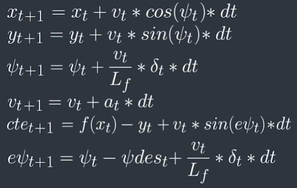

## MPC Controller project

#### The model
The model is comprised of the vehicle state, actuators, and update equations. The state is the description of the vehicle at any instantaneous point in time. For this project, the state includes the following parameters: 

| parameter | description  |
|---|---|
| `x`  | x position of the vehicle |
| `y`  | y position of the vehicle |
| `psi`| direction heading of the vehicle  |
| `v`  | velocity of the vehicle |
| `cte` | cross track error - lateral distance between vehicle center and track center |
| `epsi` | psi error - difference in angle between vehicle heading and ideal heading based upon polynomial fit to track center points. |

The actuators in this project are simply steering angle and acceleration, fed to the simulator via values in the range `[-1 1]`. 

The update equations, which are implemented as model constraints in MPC.cpp lines 100 - 130 ensure that for each time step, the state variables at time t+1 are equal to those at time t with the additional contribution of the time step for each. Here are the model equations which translate between state t and t+1:

 

#### Timestep length and elapsed duration (N & dt)
I chose `N=6` because this offered a good tradeoff between computation efficiency and controller stability. Values higher than this tended to overload my computer, causing the `Solve()` results to not come back in time for each call from the simulator, ultimately leading to the car leaving the track.
I chose `dt=0.2` as anything lower than `0.1` caused instability with the latency enabled and anything higher than `0.2` caused the car to be too slow to react to turns and target speed changes. The car looks like the driver is on the phone.

 

#### Polynomial fitting and preprocessing
My polynomial and preprocessing code is in main.cpp lines 110 to 126. The points come in in the map/world coordinate system. To make the math easier, I convert the points to the car's coordinate system via a translation followed by a rotation.
These points are then fed into the `polyfit()` function as provided in the starter code which fits a 3rd order polynomial to the points.
At this point, the current state of the car for `x, y, psi` is `0, 0, 0` in the car's coordinate system. These values are fed into the `MPC.Solve()` function.

 

#### Model predictive control with latency
The section of code dealing with latency is in main.cpp lines 102-107. I simply predicted where the car would be in 100ms and used that as the 'current' state of `x, y, psi, v` from the simulator. This solution was championed by forum mentor Alex_Cui on the Udacity forums and I used his code.
This method works because it allows the optimization routine to know where the car is going to be, taking the latency into account. It can then appropriately give corrections because it knows the car's current position instead of the past position. 